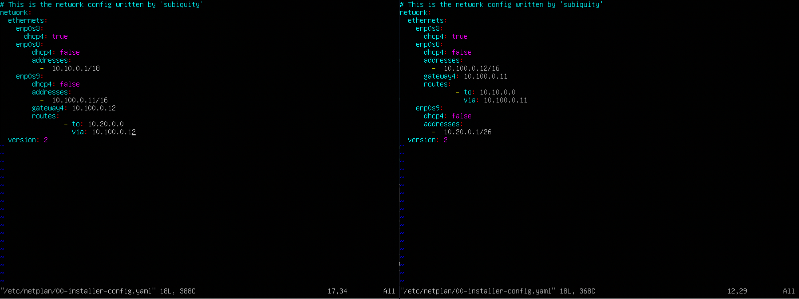
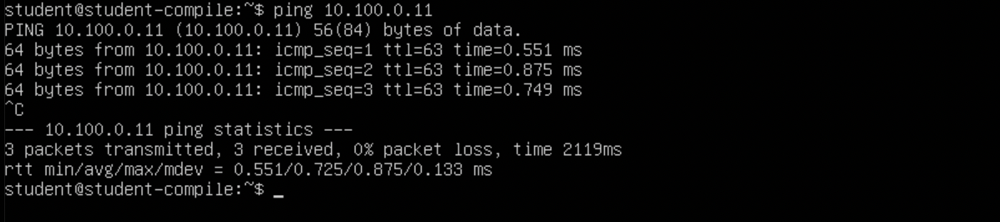
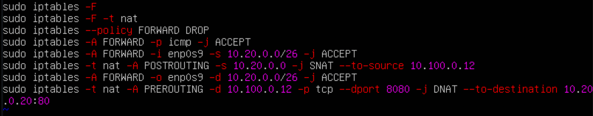

# Сети в Linux

## Part 1. Инструмент ipcalc.

* 1.1 Сети и маски:

1) Адрес сети 192.167.38.54/13

2) Перевод маски 255.255.255.0 в префиксную и двоичную запись, /15 в обычную и двоичную, 11111111.11111111.11111111.11110000 в обычную и префиксную

3) Минимальный и максимальный хост в сети 12.167.38.4 при масках; /8, 11111111.11111111.00000000.00000000, 255.255.254.0 и /4

1. Для маски /8:

2. Для маски 11111111.11111111.00000000.00000000:

3. Для маски 255.255.254.0:

4. Для маски /4:

* 1.2. localhost:

* Определить и записать в отчёт, можно ли обратиться к приложению, работающему на localhost, со следующими IP: 194.34.23.100/16, 127.0.0.2/24, 127.1.0.1/8, 128.0.0.1/8
    * По адресам 194.34.23.100/16 и 128.0.0.1/8 обратиться к приложению не получится, потому что у них нет петли.
    * У 127.0.0.2/24 и 127.1.0.1/8 есть loopback, так что к ним обратиться можно.

* 1.3. Диапазоны и сегменты сетей:

1) какие из перечисленных IP можно использовать в качестве публичного, а какие только в качестве частных:

1. 10.0.0.45/8 - Частный
2. 134.43.0.2/16 - Публичный
3. 192.168.4.2/16 - Частный
4. 172.20.250.4/12 - Частный
5. 172.0.2.1/12 - Публичный
6. 192.172.0.1/12 - Частично частный
7. 172.68.0.2/12 - Публичный
8. 172.16.255.255/12 - Частный
9. 10.10.10.10/8 - Частный
10. 192.169.168.1/16 - Публичный

2) какие из перечисленных IP адресов шлюза возможны у сети 10.10.0.0/18?

1. 10.10.0.2
2. 10.10.10.10
3. 10.10.1.255

## Part 2. Статическая маршрутизация между двумя машинами.

* С помощью команды ip a посмотреть существующие сетевые интерфейсы.

* WS-1:

* WS-2:

* Описать сетевой интерфейс, соответствующий внутренней сети, на обеих машинах и задать следующие адреса и маски: ws1 - 192.168.100.10, маска /16, ws2 - 172.24.116.8, маска /12.
  * Сетевой интерфейс для внутренней сети - enp0s8.

* WS-1:

* WS-2

* Выполнить команду netplan apply для перезапуска сервиса сети.

* WS-1:

* WS-2:

* 2.1. Добавление статического маршрута вручную:

* Добавить статический маршрут от одной машины до другой и обратно при помощи команды вида ip r add:

* WS-1:

* WS-2:

* Пропинговать соединение между машинами:

* WS-1:

* WS-2:

* 2.2. Добавление статического маршрута с сохранением:

* Добавить статический маршрут от одной машины до другой с помощью файла etc/netplan/00-installer-config.yaml:

* WS-1:

* WS-2:

* Пропинговать соединение между машинами:

* WS-1:

* WS-2:

## Part 3. Утилита iperf3:

* 3.1. Скорость соединения:

* Перевести и записать в отчёт: 8 Mbps в MB/s, 100 MB/s в Kbps, 1 Gbps в Mbps:

1. 8 Mbps = 1 MS/s. 
2. 100 MB.s = 100000 Kbps.
3. 1 Gbps = 1000 Mbps.

* Измерить скорость соединения между ws1 и ws2:

* WS-1 server:

* WS-2 server:

## Part 4. Сетевой экран:

* 4.1. Утилита iptables.

* Нужно добавить в файл подряд следующие правила:

1) на ws1 применить стратегию когда в начале пишется запрещающее правило, а в конце пишется разрешающее правило (это касается пунктов 4 и 5)

2) на ws2 применить стратегию когда в начале пишется разрешающее правило, а в конце пишется запрещающее правило (это касается пунктов 4 и 5)

3) открыть на машинах доступ для порта 22 (ssh) и порта 80 (http)

4) запретить echo reply (машина не должна "пинговаться”)

5) разрешить echo reply (машина должна "пинговаться")

* WS-1:

* WS-2:

* Запуск обоих файлов:

* WS-1:

* WS-2:

* Разница в стратегиях заключается в том, что изначально в машине ws-1 мы сначала разрешаем, а после запрещаем вывод ping'a. 
В машине ws2 всё ровным счетом наоборот.

* 4.2. Утилита nmap:

* Командой ping найти машину, которая не "пингуется", после чего утилитой nmap показать, что хост машины запущен.

## Part 5. Статическая маршрутизация сети.

* 5.1. Настройка адресов машин:

* Настроить конфигурации машин в etc/netplan/00-installer-config.yaml согласно сети на рисунке.

* R1:

* R2:

* WS11:

* WS22:

* WS21:

* Перезапустить сервис сети. Если ошибок нет, то командой ip -4 a проверить, что адрес машины задан верно. Также пропинговать ws22 с ws21. Аналогично пропинговать r1 с ws11.

* R1:

* WS11:

* R2:

* WS22:

* WS21:

* 5.2. Включение переадресации IP-адресов.

* 5.3. Установка маршрута по-умолчанию.

* Настроить маршрут по-умолчанию (шлюз) для рабочих станций. Для этого добавить gateway4 [ip роутера] в файле конфигураций.

* Вызвать ip r и показать, что добавился маршрут в таблицу маршрутизации.

* Пропинговать с ws11 роутер r2 и показать на r2, что пинг доходит.

* 5.4. Добавление статических маршрутов.

* Добавить в роутеры r1 и r2 статические маршруты в файле конфигураций.

* Вызвать ip r и показать таблицы с маршрутами на обоих роутерах.

* Запустить команды на ws11:

В отчете выбран путь отличный от 10.10.0.0 потому что этот адрес указывает на все адреса.

* 5.5. Построение списка маршрутизаторов.

* Запустить на r1 команду дампа. При помощи утилиты traceroute построить список маршрутизаторов на пути от ws11 до ws21.

* Путь строиться от узла к узлу до того момента, покаа не будет достигнута конечная точка. Каждый пакет проходит на своем пути определенное количество узлов, пока достигнет своей цели. На каждом узле добавляется счетчик, который отслеживает количество пройденых узлов.

* 5.6. Использование протокола ICMP при маршрутизации.

## Part 6. Динамическая настройка IP с помощью DHCP.

* Указать MAC адрес у ws11, для этого в etc/netplan/00-installer-config.yaml надо добавить строки: macaddress: 10:10:10:10:10:BA, dhcp4: true.

* Для r2 настроить в файле /etc/dhcp/dhcpd.conf конфигурацию службы DHCP:

1) указать адрес маршрутизатора по-умолчанию, DNS-сервер и адрес внутренней сети.
2) в файле resolv.conf прописать nameserver 8.8.8.8.

* Перезагрузить службу DHCP командой systemctl restart isc-dhcp-server. Машину ws21 перезагрузить при помощи reboot и через ip a показать, что она получила адрес. Также пропинговать ws22 с ws21.

* Для r1 настроить аналогично, но сделать выдачу адресов с жесткой привязкой к MAC-адресу (ws11). Провести аналогичные тесты.

* Запросить с ws21 обновление ip адреса.

Использовал:

1) sudo dhclient -v
2) sudp dhclietn -r
3) sudo dhclient -v

## Part 7. NAT.

* В файле /etc/apache2/ports.conf на ws22 и r2 изменить строку Listen 80 на Listen 0.0.0.0:80, то есть сделать сервер Apache2 общедоступным.

* Запустить веб-сервер Apache командой service apache2 start на ws22 и r1.

* Добавить в фаервол, созданный по аналогии с фаерволом из Части 4, на r2 следующие правила:

1) Удаление правил в таблице filter - iptables -F

2) Удаление правил в таблице "NAT" - iptables -F -t nat

3) Отбрасывать все маршрутизируемые пакеты - iptables --policy FORWARD DROP

Запускать файл также, как в Части 4.

Проверить соединение между ws22 и r1 командой ping.

При запуске файла с этими правилами, ws22 не должна "пинговаться" с r1.

* Добавить в файл ещё одно правило:

4) Разрешить маршрутизацию всех пакетов протокола ICMP

Запускать файл также, как в Части 4

Проверить соединение между ws22 и r1 командой ping

При запуске файла с этими правилами, ws22 должна "пинговаться" с r1.

* Добавить в файл ещё два правила:

5) Включить SNAT, а именно маскирование всех локальных ip из локальной сети, находящейся за r2 (по обозначениям из Части 5 - сеть 10.20.0.0).

6) Включить DNAT на 8080 порт машины r2 и добавить к веб-серверу Apache, запущенному на ws22, доступ извне сети

Проверить соединение по TCP для SNAT.
Проверить соединение по TCP для DNAT.

## Part 8. Дополнительно. Знакомство с SSH Tunnels.

* Запустить веб-сервер Apache на ws22 только на localhost (то есть не изменять файл /etc/apache2/ports.conf или, если был изменен ранее, вернуть строку Listen 80).

* Воспользоваться Local TCP forwarding с ws21 до ws22, чтобы получить доступ к веб-серверу на ws22 с ws21.

* Воспользоваться Remote TCP forwarding c ws11 до ws22, чтобы получить доступ к веб-серверу на ws22 с ws11.

